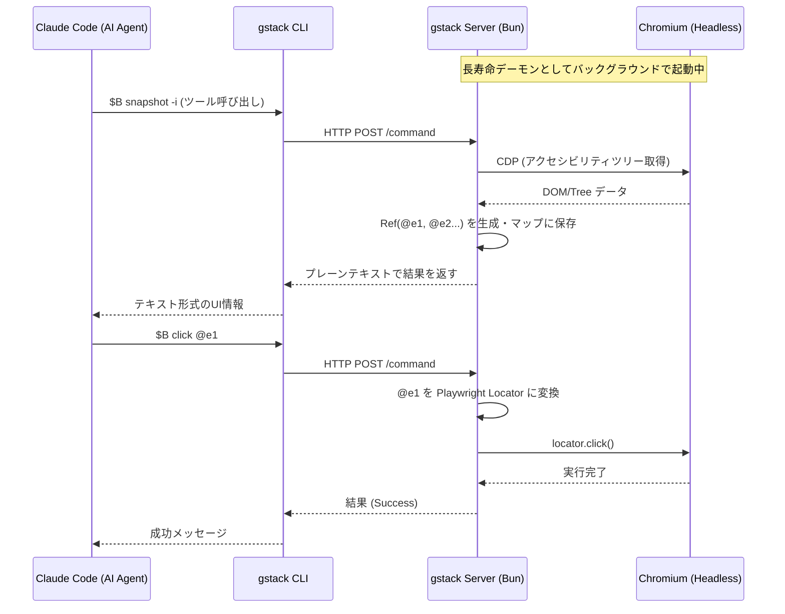

# gstack アーキテクチャの3つのコア構成要素

gstackは、AIエージェント（Claude Code等）に強力なブラウザ操作機能と専門的なワークフロースキルを提供するためのシステムです。このシステムは、単なるスクレイピングツールではなく、「AIエージェントによるチーム開発」を実現するために、以下の**3つのコア構成要素**で成り立っています。

1. **gstack本体（インフラストラクチャ）**
2. **SKILL.md テンプレートシステム（ナレッジベース）**
3. **並列オーケストレーション（Conductor / Multi-agent）**

---

## 1. gstack本体（インフラストラクチャ）

gstackの「手足」となる部分です。特定のタスク（QAやデザインなど）に依存せず、HTTP経由でブラウザを操作するための抽象化された汎用インターフェースを提供します。

### 特徴
- **長寿命デーモンと状態の永続化:** コマンドのたびにブラウザを再起動するのではなく、バックグラウンドでChromiumを起動し続けることで、Cookie、タブ、ログインセッションを維持します。これにより、2回目以降の操作は100〜200ミリ秒という「サブセカンド」で応答します。
- **Refシステム:** DOMに直接干渉せず、アクセシビリティツリーを基にした独自のRef（`@e1`, `@c1`など）を発行し、AIが確実に要素を特定・操作できる仕組みを提供します。

### アーキテクチャ図（gstack本体の動作）



---

## 2. SKILL.md テンプレートシステム（ナレッジベース）

gstackの「脳」となる部分です。汎用的なgstack本体に対して、「品質保証（QA）」や「コードレビュー」といった専門的な手順や思考法を教え込みます。

### 特徴
- **関心の分離:** 新しいタスクをAIに学習させたい場合は、本体のコードを修正するのではなく、独立したディレクトリに新しい `SKILL.md` を追加するだけで済みます。
- **事前ビルドによる整合性の担保:** 人間が書く手順（テンプレート：`.tmpl`）とソースコードから抽出されたメタデータ（コマンド一覧など）をビルド時にマージすることで、「ドキュメントと実装の乖離」を防ぎます。
- **Preambleによる標準化:** 全スキル共通で、AIに対する「質問フォーマットの統一」や「運用後の振り返り（自己改善ループ）」を強制的に埋め込みます。

### テンプレートシステムのビルドフロー

```mermaid
flowchart TD
    A[SKILL.md.tmpl\n人間の書いた手順・プロンプト] --> C{gen-skill-docs.ts\nビルドスクリプト}
    B[Source Code\nメタデータ: コマンド一覧・フラグなど] --> C
    C -->|マージ・検証| D[SKILL.md\nAIエージェントが実行時に読み込む]

    subgraph "プレースホルダーの例"
    E[{{COMMAND_REFERENCE}}]
    F[{{PREAMBLE}}]
    G[{{QA_METHODOLOGY}}]
    end
    E -.- A
    F -.- A
    G -.- A
```

---

## 3. 並列オーケストレーション（Conductor / Multi-agent）

gstackが持つ「チームマネジメント」の機能です。単一のAIを動かすだけでなく、複数のAIを同時並行で走らせたり、異なるAI同士を協調させたりする高度な運用を支えます。

### 特徴
- **ポート競合の回避:** 各ブラウザデーモンは10000〜60000番のランダムなポートを自動で探して立ち上がるため、同じマシン内で10〜15のClaudeセッション（スプリント）を同時に実行できます（[Conductor](https://conductor.build)との連携）。
- **マルチAIの協調 (`/pair-agent`, `/codex`):** Claude、OpenAI Codex、その他のAIが同じブラウザ画面を共有し、タブを分けて作業したり、クロスレビュー（ダブルチェック）を行ったりすることが可能です。

### 並列・協調アーキテクチャ図

```mermaid
graph TD
    subgraph "Workspace 1 (e.g. Feature A)"
        C1[Claude Code 1\nSkill: /office-hours] <--> S1[gstack Server\nPort: 12345] <--> B1[Chromium]
    end

    subgraph "Workspace 2 (e.g. Bugfix B)"
        C2[Claude Code 2\nSkill: /qa] <--> S2[gstack Server\nPort: 45678] <--> B2[Chromium]
    end

    subgraph "Workspace 3 (Cross-AI Coordination)"
        C3[Claude Code 3\nSkill: /pair-agent] <--> S3[gstack Server\nPort: 34567]
        Codex[OpenAI Codex CLI] <--> S3
        S3 <--> B3[Chromium\n(Shared Browser)]
        B3 --- T1[Tab: Claude]
        B3 --- T2[Tab: Codex]
    end

    Conductor[Conductor\n(Orchestrator)] -.-> C1
    Conductor -.-> C2
    Conductor -.-> C3
```

---

## 全体のまとめ

これら3つの要素が組み合わさることで、gstackは以下のサイクルを実現しています：
1. **(Conductor)** が複数のAIに役割（レビュー、実装、QA）を与えて並列起動し、
2. **(SKILL.md)** が各AIにその役割専用の「専門的で正しい手順」を教え、
3. **(gstack本体)** が、AIの手足となって高速かつ正確にブラウザを操作する。

これにより、gstackは単なる自動化ツールを超え、「独立して自律稼働するAI開発チーム」の基盤として機能しています。
